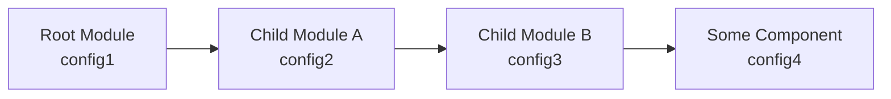

# ngx-form-helper
angular 表单验证辅助插件 for angular >= 6

## 插件特性
* 极简的使用方式，屏蔽 angular 验证底层细节
* 内置丰富的功能，如：自动滚动到第一个错误域、防重复提交、消息动画、隐藏域滚动代理、全局配置叠加等
* 内置两种使用最广泛的错误提示显示方式
* 丰富的参数配置，易于适配各种使用场景
* 可通过继承内置基类，仅仅实现个别接口实现自定义的错误提示方式
* template driven 和 model driven 表单都支持

## DEMO
<https://ngx-form-helper-demo.stackblitz.io>

## 安装
> npm install ngx-form-helper --save
>
> PS：请使用`3.0.0`及之后的版本

## 使用
#### 1. 引入module
``` js
import { FormHelperModule } from 'ngx-form-helper';

@NgModule({
    imports: [
        FormHelperModule
    ]
})
export class AppModule {
}
```

#### 2. 引入内置样式
如果使用 webpack 打包方式，在项目中第三方插件入口文件(通常为`vendor.ts`)中添加如下代码
``` js
// vendor.ts
import 'ngx-form-helper/ngx-form-helper.css';
```
``` js
// webpack.js
module.exports = {
    ...
    entry: {
        ...
        'vendor': './src/vendor.ts',
    }
    ...
}
```

如果使用的是 angular cli，在 angular.json 中引入样式文件
``` json
{
  ...
  "projects": {
    "app": {
      ...
      "architect": {
        "build": {
          "builder": "@angular-devkit/build-angular:browser",
          "options": {
            ...
            "styles": [
              ...
              "node_modules/ngx-form-helper/ngx-form-helper.css"
            ]
          }
        }
      }
    }
  }
}
```

#### 3. 具体使用方式及效果请参见[demo](https://ngx-form-helper-demo.stackblitz.io)

## 配置文档

> 名词解释  
> 
> 表单域：指绑定了 ngModel、formControl、formControlName 中某一个指令的控件  
> 表单组：指绑定了 ngModelGroup、formGroup、formGroupName、formArray、formArrayName 中某一个指令的控件    
> 父域：指表单域/表单组的父控件。父域必定为表单组  
> 子域：指表单组的子孙控件。子域可能为表单域，也可能为表单组  
> 错误域：指验证失败的表单域或表单组  

#### 1. formHelper 指令配置
使用方法如下：
``` html
<form formHelper [autoReset]="false" (validPass)="request($event)" ...></form>
```

| `输入属性`配置项                 | 参数类型                                        | 默认值                | 说明 |
| :------------------------------- | :---------------------------------------------- | :-------------------- | :--- |
| autoReset                        | boolean                                         | true                  | `成功提交`后是否自动重置表单<br><br>**成功提交：指验证通过且提交回调函数`(resultOkAssertion)`执行也符合预期**
| context                          | window/ElementRef/Element/string                | window                | 表单所处上下文，通常为 window 或含有滚动条的对象，影响滚动条正确滚动到第一条错误。<br><br>当类型为 string 时，支持[css选择器](https://developer.mozilla.org/zh-CN/docs/Learn/CSS/Introduction_to_CSS/Selectors)和`点号表达式`<br><br>**点号表达式：语法：. => 当前元素，.. => 父元素，../../ etc**
| scrollProxy                      | string                                          |                       | 滚动代理<br><br>默认滚动到错误域本身，但当错误域本身处于不可见状态时，使用另一个可见对象作为代理。若没有设置滚动代理，且错误域本身不可见，会一直寻找其父域直到 ngForm (不包含)，使用第一个可见域作为代理<br><br>语法：^ => 父节点，~ => 前一个兄弟节点，+ => 后一个兄弟节点，可以任意组合<br>示例：^^^，^2，~3^4+2  
| autoScroll                       | boolean                                         | true                  | 是否自动滚动到第一个错误
| offsetTop                        | number                                          | 0                     | 滚动定位使用，错误域距离浏览器顶部偏移量。<br><br>默认滚动到第一个错误域与浏览器可视区域顶部重合处，但大多数情况下页面是有绝对定位(absolute)或固定定位(fixed)的头部的，此时会盖住滚动到此的错误域，通过设置 offsetTop 解决此问题
| validateImmediate                | boolean                                         | false                 | 设置表单域或表单组是否`初始`就显示错误<br><br>默认只在控件 dirty 状态触发错误显示，所以表单初始不会显示错误，当用户修改了表单或点提交按钮后才会显示错误
| validateImmediateDescendants     | boolean                                         | true                  | 设置`表单组`是否`初始`就显示其所有子域的错误<br><br>此配置在`validateImmediate = true`的条件下才有效，且只对`表单组`有效
| classNames                       | string/false                                    | fh-theme              | 表单域主题。指定的字符串会添加到form类名中。可设置多个值，空格符分割。插件已为默认值定义了一套主题样式，可通过修改配置实现自定义主题
| errorClassNames                  | string/false                                    | fh-error              | 验证失败时`表单域`自动添加的类名
| errorGroupClassNames             | string/false                                    | fh-group-error        | 验证失败时`表单组`自动添加的类名。默认主题没有为 fh-group-error 设置样式，用户可在自己的样式文件中定义具体样式
| resultOkAssertion                | (res: any) => boolean                           |                       | 判断请求是否成功的断言函数，res为请求返回值，仅当执行结果为 true 时，才会继续执行`SubmitWrapper 监听函数`和自动重置表单<br><br>默认根据请求状态码处理，200为请求成功，否则为失败。如果用户包装了请求响应，比如使用自定义状态码代表请求状态，需要使用此配置指定判断逻辑

| `输出属性`配置项 | 传递参数       | 说明 |
| :--------------- | :------------- | :--- |
| validFail        |                | 验证不通过
| validPass        | SubmitWrapper  | 验证通过

##### SubmitWrapper 说明
作用：连接请求与请求后续处理的桥梁  
原因：以rxjs为例，请求通常写法为 request.subscribe(() => callback())，插件需要在 request 与 callback 之间插入一些操作，借助 submitWrapper(request).subscribe(() => callback()) 实现功能  
说明：请求为`异步`时，接收一个 Observable / Promise 或返回 Observable / Promise 的函数。请求为`同步`时，接收一个任意值或返回任意值的函数

> PS：即使没有 request 只有 callback 的情况下也不能省略 submitWrapper，应写成 submitWrapper().subscribe(() => callback())。
> 因为 submitWrapper 中有许多插件内置操作，不能省略调用

``` js
// 原型
export type SubmitWrapper = (
    request?: Observable<any> | Promise<any> | ((...args: any[]) => Observable<any> | Promise<any> | any) | any
) => Observable<any>;
```

``` js
// 示例1 - 异步流
request(submitWrapper: SubmitWrapper) {
    // do something
    ...
    
    submitWrapper(this.userService.addOrUpdate(this.user)).subscribe(() => {
        // do something
        ...
    })
}

// 示例2 - 异步函数
request(submitWrapper: SubmitWrapper) {
    // do something
    ...
    
    submitWrapper(() => {
        // do something
        ...
        
        // 必须将异步流返回
        if (xxx) {
            return this.userService.add(this.user);
        } else {
            return this.userService.update(this.user);
        }
    }).subscribe(() => {
        // do something
        ...
    })
}

// 示例3 - 同步值
request(submitWrapper: SubmitWrapper) {
    // do something
    ...
    
    submitWrapper().subscribe(() => {
        // do something
        ...
    })
}

// 示例3 - 同步函数
request(submitWrapper: SubmitWrapper) {
    // do something
    ...
    
    submitWrapper(() => {
        // do something
        ...
    }).subscribe(() => {
        // do something
        ...
    })
}
```

| 公共成员             | 类型                                                | 说明 |
| :------------------- | :-------------------------------------------------- | :--- |
| ngForm               | ControlContainer                                    | 关联的 angular form 实例，template driven form 时为 NgForm，Model driven form 时为 FormGroup
| form                 | HTMLFormElement                                     | dom 元素
| controls             | { [key: string]: AbstractControl }                  | 控件树
| submit               | (submitHandler?: SubmitHandler) => void             | 提交处理函数，不需要用户调用，通常在实现自定义的提交处理指令时需要。详情参见`自定义提交处理组件（SubmitHandler）`章节文档
| reset                | () => void                                          | 重置，在重置按钮使用了 #reset 模板变量时可省略调用。详情参见`shLoader 指令配置`章节文档
| repositionMessages   | (type?: RefType / AbstractControl, delay?: number)  | 重定位错误消息<br><br>页面布局变化时，某些绝对定位错误消息位置可能需要重新定位。window:resize 事件已被插件处理，会自动重定位错误消息，其他情况需要手动调用此方法<br><br>参数：<br>type：需要重定位错误信息关联的表单控件指引，当控件为表单组时，其子域也会同时重定位<br>delay：延时重定位时间，默认不延时

##### RefType 说明
作用：错误信息关联的表单控件指引  
可用格式：  
a）string  -> name/ngModelGroup/formControlName/formGroupName/formArrayName  
b）control -> 表单控件对象，通常为模板变量，如：#ctrl="ngModel/ngModelGroup"

``` js
// 原型
export type RefType = string | NgModel | NgModelGroup;
```

##### 默认主题附加样式
``` html
<!-- 表单域添加 ignore 类，将忽略给该元素设置验证失败样式 -->
<input type="text" class="ignore" name="name" [(ngModel)]="xxx" required>

<!-- 表单域添加 thin 类，将设置元素左边框为细边框样式 -->
<input type="text" class="thin" name="name" [(ngModel)]="xxx" required>
```

#### 2. shLoader 指令配置
主要作用：防重复提交和设定等待请求返回前的 loading 反馈  
使用方法如下：
``` html
<!-- 提交按钮在表单内部 -->
<form formHelper>
    <button type="button" shLoader>保存</button>
</form>

<!-- 提交按钮在表单外部 -->
<form formHelper #formHelperCtrl="formHelper"></form>
<button type="button" shLoader [refForm]="formHelperCtrl">保存</button>
```

| `输入属性`配置项         | 参数类型              | 默认值                  | 说明 |
| :----------------------- | :-------------------- | :---------------------- | :--- |
| classNames               | string                | sh-loader-theme         | 全局主题样式<br><br>指定的字符串会添加到指令所在元素类名中。可设置多个值，空格符分割。插件已为默认值定义了一套主题样式，可通过修改配置实现自定义主题
| iconClassNames           | string                | sh-loader-theme-icon    | 局部图标主题样式
| iconSelector             | string/false          | i.icon, i.fa            | 寻找图标的选择器，若找到，则使用`局部图标主题样式`，否则使用`全局主题样式`
| iconToggleStrategy       | APPEND/REPLACE        | APPEND                  | 图标类名的替换策略，append: 在原有类名基础上增加，replace: 完全使用新类名替换原类名
| duration                 | number                | 400                     | loader动画时长(ms)
| disableTheme             | boolean               | false                   | 是否禁用主题样式
| refForm                  | FormHelperDirective   |                         | 当 submit 元素在 form 外部时有用，使用此属性关联 formHelper 实例

如果不需要 shLoader 指令的功能，还可以使用为提交按钮添加 #submit 模板变量的方式
``` html
<form formHelper>
    <button type="button" #submit>保存</button>
</form>
```

同此，重置按钮使用 #reset 模板变量方式
``` html
<form formHelper>
    <button type="button" #reset>重置</button>
</form>

<!-- 绑定事件方式 -->
<form formHelper #formHelperCtrl="formHelper">
    <button type="button" (click)="formHelperCtrl.reset()">重置</button>
</form>
```

> 单独使用 type="submit"、type="reset" 不具备插件附加的一些功能  
> 为防止出现未知影响，请一律使用 type="button"，不要使用 <button type="submit" #submit></button>、< button type="button" shLoader></button> 和 <button type="reset" #reset></button> 的方式

#### 3. eh-text 组件配置
主要作用：文本形式的错误消息  
特色：当多个验证条件失败时，显示期中一个错误消息，其他隐藏  
使用方法如下：
``` html
<!-- 示例1 - 消息体为文本节点 -->
<input type="text" name="name" [(ngModel)]="xxx" required pattern="[a-zA-Z]*">
<eh-text ref="name">
  <eh-text-message error="required">不能为空</eh-text-message>
  <eh-text-message error="pattern">请输入字符</eh-text-message>
</eh-text>

<!-- 示例2 - 消息体为属性 -->
<input type="text" name="name" [(ngModel)]="xxx" required pattern="[a-zA-Z]*">
<eh-text ref="name">
  <eh-text-message error="required" message="不能为空"></eh-text-message>
  <eh-text-message error="pattern" message="请输入字符"></eh-text-message>
</eh-text>

<!-- 
示例3 - 消息为输入属性

// 有序，优先显示排在前面的错误消息
messages = [
    { error: "required", message: "不能为空" },
    { error: "pattern", message: "请输入字符" }
];

// 无序，多个验证条件失败时，显示任意一个错误消息
messages = {
    required: "不能为空",
    pattern: "请输入字符"
};
-->
<input type="text" name="name" [(ngModel)]="xxx" required pattern="[a-zA-Z]*">
<eh-text ref="name" [errorMessages]="messages"></eh-text>
```

| `输入属性`配置项         | 参数类型                                       | 默认值                  | 说明 |
| :----------------------- | :--------------------------------------------- | :---------------------- | :--- |
| classNames               | string/false                                   | eh-text-theme           | 主题样式<br><br>指定的字符串会添加到组件所在元素类名中。可设置多个值，空格符分割。插件已为默认值定义了一套主题样式，可通过修改配置实现自定义主题
| inline                   | boolean                                        | true                    | 错误文本是否使用行内样式，对应 display: inline / block
| fontSize                 | number                                         | 13                      | 字体大小
| offsetX                  | number                                         | 0                       | x轴偏移，用来微调错误消息位置
| offsetY                  | number                                         | 0                       | y轴偏移，用来微调错误消息位置
| float                    | boolean                                        | false                   | 是否浮动，浮动时采用绝对定位
| right                    | boolean                                        | false                   | 错误文本是否右对齐
| animation                | fade、slideUp、slideDown、flyLeft、flyRight    |                         | 消息显示动画
| errorMessages            | TextMessage[] / { [ error: string ]: string }  |                         | 消息定义对象

``` js
// 原型
export class TextMessage {

    // 验证规则对应的名称
    error: string;

    // 验证不通过时显示的消息
    message: string;
}
```

#### 4. eh-tooltip 组件配置
主要作用：标签形式的错误消息  
特色：所有错误消息同时展示，动态切换消息状态，异步验证有 loading 反馈  
使用方法如下：

``` html
<!-- 示例1 - 消息体为文本节点 -->
<input type="text" name="name" [(ngModel)]="xxx" required pattern="[a-zA-Z]*">
<eh-tooltip ref="name">
  <eh-tooltip-message error="required" [async]="false">不能为空</eh-tooltip-message>
  <eh-tooltip-message error="pattern" [async]="false">请输入字符</eh-tooltip-message>
</eh-tooltip>

<!-- 示例2 - 消息体为属性 -->
<input type="text" name="name" [(ngModel)]="xxx" required pattern="[a-zA-Z]*">
<eh-tooltip ref="name">
  <eh-tooltip-message error="required" message="不能为空" [async]="false"></eh-tooltip-message>
  <eh-tooltip-message error="pattern" message="请输入字符" [async]="false"></eh-tooltip-message>
</eh-tooltip>

<!-- 
示例3 - 消息为输入属性

// 有序
messages = [
    { error: "required", message: "不能为空", order: 0, async: false, context: null },
    { error: "pattern", message: "请输入字符", order: 0, async: false, context: null }
];

// 无序 - 字符串
// 此方式将不能定义 order、async、context
messages = {
    required: "不能为空",
    pattern: "请输入字符"
};

// 无序 - 对象
messages = {
    required: { message: "不能为空", order: 0, async: false, context: null },
    pattern: { message: "请输入字符", order: 0, async: false, context: null }
};
-->
<input type="text" name="name" [(ngModel)]="xxx" required pattern="[a-zA-Z]*">
<eh-tooltip ref="name" [errorMessages]="messages"></eh-tooltip>
```

| `输入属性`配置项         | 参数类型                                                    | 默认值                  | 说明 |
| :----------------------- | :---------------------------------------------------------- | :---------------------- | :--- |
| classNames               | string/false                                                | eh-text-theme           | 主题样式<br><br>指定的字符串会添加到组件所在元素类名中。可设置多个值，空格符分割。插件已为默认值定义了一套主题样式，可通过修改配置实现自定义主题
| fontSize                 | number                                                      | 13                      | 字体大小
| offsetX                  | number                                                      | 0                       | x轴偏移，用来微调错误消息位置
| offsetY                  | number                                                      | 0                       | y轴偏移，用来微调错误消息位置
| position                 | TooltipPosition                                             | BOTTOM_RIGHT            | 提示相对表单域/表单组的位置
| positionProxy            | string                                                      |                         | 错误消息定位代理<br><br>默认相对于表单域/表单组本身定位，可使用任意其他元素作为代理。代理元素必须包含在错误消息直接父元素下<br><br>语法：参见 formHelper 的 scrollProxy<br><br>PS：参照物为`关联的表单域/表单组`，而不是错误消息自身
| duration                 | number                                                      | 200                     | 显示/隐藏动画时长(ms)，动画固定为 fade
| zIndex                   | number                                                      | 1                       | z-index 值
| errorMessages            | TooltipMessage[] / { [ error: string ]: Message / string }  |                         | 消息定义对象

``` js
// 原型
export enum TooltipPosition {

    TOP_LEFT = 'top left', TOP_CENTER = 'top center', TOP_RIGHT = 'top right',

    BOTTOM_LEFT = 'bottom left', BOTTOM_CENTER = 'bottom center', BOTTOM_RIGHT = 'bottom right',

    RIGHT_CENTER = 'right center', LEFT_CENTER = 'left center'
}

export class Message {

    // 验证不通过时显示的消息
    message: string;

    // 验证规则是否是异步
    // 异步有特定反馈动画，请正确设置
    async?: boolean;

    // 顺序
    order?: number;

    // 消息占位符被替换时的上下文环境
    // 全局通用消息在不同组件中使用时有用
    context?: any;
}

export class TooltipMessage extends Message {

    // 验证规则对应的名称
    error: string;
}
```

| 公共成员             | 类型                 | 说明 |
| :------------------- | :------------------- | :--- |
| reposition           | () => void           | 错误消息重定位<br><br>插件自动调用，当出现插件无法跟踪的页面布局变化时，需要用户手动调用

``` html
<!-- 示例 - 重定位 -->
<textarea name="name" required autoSize (sizeChange)="nameCtrl.reposition()"></textarea>
<eh-tooltip ref="name" #nameCtrl="ehTooltip">
    <eh-tooltip-message error="required">不能为空</eh-tooltip-message>
</eh-tooltip>
```

#### 5. ehSimple 指令配置
主要作用：标记任意元素为错误处理控件  
特色：没有错误消息，仅被标记的控件自身和对应的表单域/表单组有反馈  
使用方法如下：
``` html
<!-- 示例1 - 作用在任意元素，引用表单域/表单组。此方式与 eh-text/eh-tooltip 相同 -->
<input type="text" name="name" [(ngModel)]="xxx" required pattern="[a-zA-Z]*">
<div ehSimple ref="name"></div>

<!-- 示例2 - 作用在表单域/表单组上 - 此情况不需要设置 ref 属性 -->
<input type="text" name="name" [(ngModel)]="xxx" required pattern="[a-zA-Z]*" ehSimple>
```

| `输入属性`配置项         | 参数类型                | 默认值                  | 说明 |
| :----------------------- | :---------------------- | :---------------------- | :--- |
| errorClassNames          | string/false            | eh-simple-error         | 验证失败时自身自动添加的类名

| 公共成员                     | 类型                        | 说明 |
| :--------------------------- | :-------------------------- | :--- |
| repositionMessages           | (delay?: number) => void    | 错误消息重定位<br><br>当关联控件为表单组时，其子域也会同时重定位<br><br>参数：<br>delay：延时重定位时间，默认不延时

#### 6. eh-text、eh-tooltop、ehSimple 共有配置
| `输入属性`配置项              | 参数类型                | 默认值          | 说明 |
| :---------------------------- | :---------------------- | :-------------- | :--- |
| ref                           | RefType                 |                 | 错误信息关联的表单控件
| scrollProxy                   | string                  |                 | 覆盖 formHelper 中的 scrollProxy
| validateImmediate             | boolean                 | false           | 覆盖 formHelper 中的 validateImmediate
| validateImmediateDescendants  | boolean                 | false           | 覆盖 formHelper 中的 validateImmediateDescendants

## 内置验证器

#### 1. trimmedRequired
主要作用：验证是否为空。同 angular 自带的 required 区别是本规则剔除空白符  
适用对象：表单域  
验证失败时返回：{ trimmedRequired: true }  
使用方法如下：
``` html
<!-- template driven form -->
<input type="text" name="name" [(ngModel)]="xxx" trimmedRequired>

<!-- 
model driven form 

// xxx.component.ts
name = new FormControl('', [ trimmedRequired ]);
-->
<input type="text" name="name" formControlName="name">
```

#### 2. listRequired
主要作用：验证数组长度在 minListNum ~ maxListNum 之间  
适用对象：表单域  
数组不存在或长度为0时返回：{ listRequired: true }  

参数：  
minListNum：数组最小长度，非必填，失败返回 { minListNum: true }   
maxListNum：数组最大长度，非必填，失败返回 { maxListNum: true }   

使用方法如下：
``` html
<!-- template driven form -->
<input type="text" name="name" [(ngModel)]="xxx" listRequired minListNum="2" maxListNum="4">

<!-- 
model driven form 

// xxx.component.ts
name = new FormControl('', [ listRequired({ minListNum: 2, maxListNum: 4 }) ]);
-->
<input type="text" name="name" formControlName="name">
```

#### 3. checkboxRequired
主要作用：验证某表单组下的多选框(checkbox)勾选数量在 minCheckedNum ~ maxCheckedNum 之间  
适用对象：表单组  
勾选数量为0时返回：{ checkboxRequired: true }  

参数：  
minCheckedNum：勾选数量最小值，非必填，失败返回 { minCheckedNum: true }   
maxCheckedNum：勾选数量最大值，非必填，失败返回 { maxCheckedNum: true }   

使用方法如下：
``` html
<!-- template driven form -->
<div ngModelGroup="group" checkboxRequired minCheckedNum="2" maxCheckedNum="4">
    <!-- checkboxes -->
    ...
</div>

<!-- 
model driven form 

// xxx.component.ts
group = new FormGroup([ ... ], [ checkboxRequired({ minCheckedNum: 2, maxCheckedNum: 4 }) ]);
-->
<div ngModelGroup="group" formGroup="group">
    <!-- checkboxes -->
    ...
</div>
```

## 全局配置叠加
假如有如下组件树，在组件自身和其任意祖先模块中定义了全局配置

最终插件得到的`全局配置` = extend({}, config1, config2, config3, config4);

> 指令/组件自身的`输入属性配置`优先级永远`大于全局配置`  

#### 1. formHelper 全局配置
``` js
// 示例
@NgModule({
    ...
    providers: [
        ...
        formHelperConfigProvider({
            autoReset: false,
            offsetTop: 100
            ...
        })
    ]
})
export class XxxModule {
}
```

#### 2. shLoader 全局配置
``` js
// 示例
submitHandlerLoaderConfigProvider({
    duration: 300
    ...
})
```

#### 3. eh-text 全局配置
``` js
// 示例
errorHandlerTextConfigProvider({
    animation: 'flyLeft'
    ...
})
```

#### 4. eh-tooltip 全局配置
``` js
// 示例
errorHandlerTooltipConfigProvider({
    fontSize: 14
    ...
})
```

#### 5. ehSimple 全局配置
``` js
// 示例
errorHandlerSimpleConfigProvider({
    errorClassNames: 'eh-simple-error my-special-style'
    ...
})
```

## 自定义
#### 1. 自定义提交处理组件（SubmitHandler）
``` js
// 原型
export interface SubmitHandler {

    // 初始点击submit按钮
    start(): void;

    // 表单请求结束
    end(): Promise<any> | Observable<any> | void;
}

// 自定义提交处理组件
export class SubmitHandlerXxxDirective implements SubmitHandler {
    
    start() {
        // do something
    }
    
    end() {
        // do something
    }
}
```

#### 1. 自定义错误消息处理组件（ErrorHandler）
ErrorHandler 为抽象类，内部已实现功能如下：
- 根据 ref 输入属性自动关联表单域/表单组
- 关联表单域/表单组成功后触发 onControlPrepared 回调，该回调由继承类实现
- 自带 scrollProxy、validateImmediate、validateImmediateDescendants 输入属性，并覆盖 formHelper 中相应属性
- 监听控件状态，自动触发 whenValid、whenInvalid、whenPending 回调，这些回调由继承类实现
- 继承类如果实现了 reposition 回调，插件会在 window:resize 事件中自动调用
- 内置 hasError(error:string) => ValidationErrors | null 方法，简化错误判断
- 内置 compileMessage(context: any, message: string) => string 方法，根据指定上下文替换消息中的占位符

| 可能需要实现的接口       | 说明 |
| :----------------------- | :--- |
| whenValid                | 验证成功回调
| whenInvalid              | 验证失败回调
| whenPending              | 处于验证中时的回调
| reposition               | 消息定位，通常在每次 whenInvalid 时调用一次，防止页面布局变化导致绝对定位消息显示位置不准确。window:resize 事件自动调用
| onControlPrepared        | 消息处理组件关联表单域/表单组是由基类自动完成的，可根据需要在关联成功后执行一些操作
